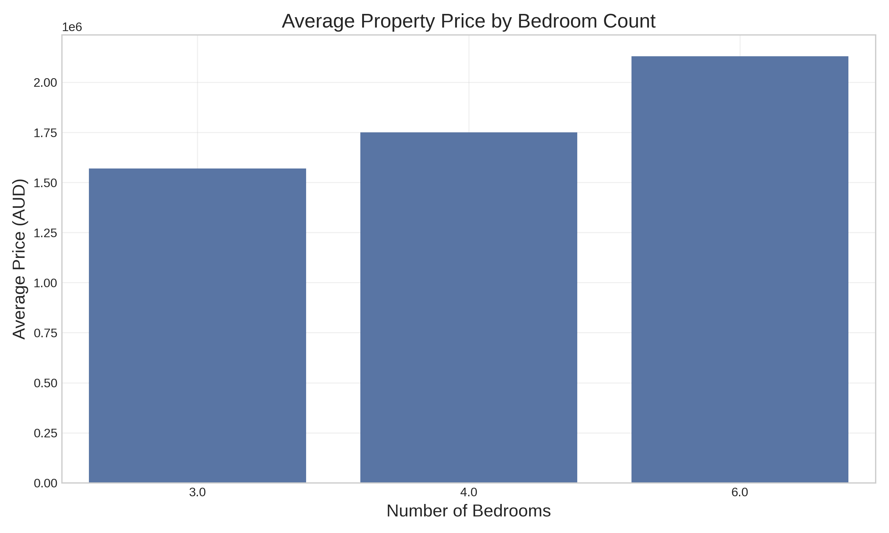

# Ermington Property Market Analysis

## Executive Summary

This analysis examines the property market in Ermington, NSW, Australia, with a focus on identifying opportunities for property flipping. Based on recent sales data, market trends, and demographic information, Ermington presents a stable market with moderate growth potential, making it suitable for strategic property investment.

## Market Overview

Ermington is a family-friendly suburb located approximately 15 kilometers from Sydney CBD, with a population of 10,994 to 12,686 residents (2021 Census). The suburb is projected to grow to 13,696 residents by 2025 and 18,701 residents by 2046, indicating long-term growth potential.

### Current Market Snapshot (2024-2025)

- **Median House Price**: $1,920,000
- **Median Unit Price**: $745,000
- **Annual Capital Growth Rate**: 3.78% for houses
- **Compound Growth Rate**: 2.7% for houses, 1.1% for units

## Price Analysis

The price distribution of properties in Ermington shows a concentration in the $1.5-2.0 million range for houses, with a median house price of $1,920,000. Units are significantly more affordable, with a median price of $745,000.

### Price Trends

Analysis of recent sales data shows a slight upward trend in property prices from 2023 to 2024. While the growth is moderate, it indicates a stable market with potential for appreciation.

### Property Type Comparison

Houses dominate the Ermington market, representing 9 out of 10 recent sales in our dataset. The average house price is approximately $1,737,988, while units average around $757,500.

### Price by Bedroom Count

Our analysis shows a clear correlation between bedroom count and property price:
- 3-bedroom houses: Average price of $1,569,000
- 4-bedroom houses: Average price of $1,750,000
- 6-bedroom houses: Average price of $2,130,000

This suggests that adding bedrooms during renovation could significantly increase property value.

### Sales Volume

Recent sales activity shows fluctuations in monthly volume, with a notable increase in sales during March-May 2024. This could indicate a seasonal pattern or growing market interest.

## Market Opportunities

### Target Property Profile

Based on our analysis, the ideal property for flipping in Ermington would be:
1. **3-bedroom houses** with potential to add a 4th bedroom
2. **Older properties** requiring modernization
3. **Properties in the $1.4-1.6 million range** (below median price)
4. **Properties with renovation potential** but sound structural elements

### Renovation Opportunities

The Ermington market offers diverse renovation opportunities including:
- Comprehensive interior renovations
- Property expansions (adding bedrooms/bathrooms)
- Modern kitchen and bathroom upgrades
- Outdoor living space improvements
- Energy efficiency upgrades

## Demographic Insights

Understanding the demographic profile of Ermington is crucial for targeting renovations to meet market demand:

- **Predominant Age Group**: 30-39 years
- **Primary Household Type**: Couples with children
- **Cultural Diversity**: 48% overseas-born residents (higher than Sydney Metro average)
- **Top Ancestries**: Chinese, Australian, English

These demographics suggest a market preference for family-friendly homes with modern amenities and potentially culturally-specific design elements.

## Investment Considerations

### Market Stability

Ermington shows moderate but steady growth with a 3.78% annual capital growth rate for houses. This stability suggests lower risk compared to more volatile markets, but also potentially lower short-term returns.

### Renovation Costs vs. Return

Based on current market data and renovation cost estimates:
- Basic renovations: $1,000 – $2,500 per sqm
- Mid-range renovations: $2,500 – $4,000 per sqm
- Luxury renovations: $4,000+ per sqm

For optimal ROI in the Ermington market, mid-range renovations targeting the family demographic appear most suitable.

### Profit Margin Potential

Property flippers typically aim for around 15% profit of the After Repair Value (ARV). In Ermington, this would mean targeting a profit of approximately $250,000-$300,000 on a median-priced house after renovation costs.

## Risk Assessment

### Market Risks

- Moderate growth rate (3.78%) may limit short-term appreciation
- Limited inventory of suitable properties for flipping
- Potential interest rate fluctuations affecting buyer demand

### Regulatory Considerations

Property development in Ermington is subject to Parramatta City Council zoning regulations. Investors should verify zoning classifications and development restrictions before acquisition.

## Conclusion

Ermington presents a stable market with moderate growth potential for property flipping. The ideal strategy appears to be targeting 3-bedroom houses below median price with renovation potential, implementing mid-range renovations focused on family-friendly features, and aiming for a 15% profit margin.

The combination of steady population growth, family-oriented demographics, and consistent price appreciation makes Ermington a suitable location for strategic property investment, particularly for investors seeking balanced risk-return profiles.