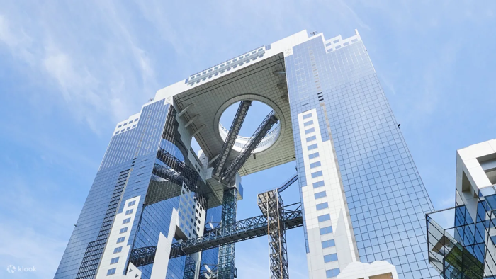
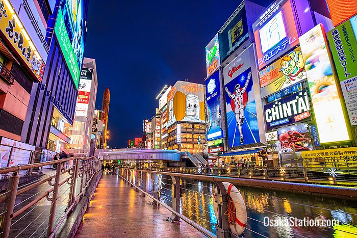
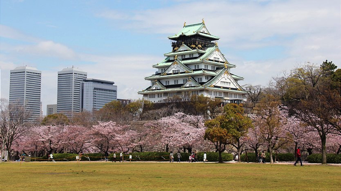

### Osaka, Japan Itinerary

**Day 1: Arrival and Orientation**
- Morning: Arrive in Osaka. Check into your hotel and get settled.
- Afternoon: Visit the Umeda Sky Building for panoramic city views.

- Evening: Explore the Dotonbori area for dinner and vibrant nightlife scenes.

**Day 2: Universal Studios Japan**
- Full day: Enjoy Universal Studios Japan. Note: Event schedules and special attractions for December are subject to change. It's recommended to check the official website closer to your visit date.

<iframe width="550" height="300" src="https://www.youtube.com/embed/bBkCbm4b0vI?si=uNclmth-2M4nINLf" frameborder="0" allow="accelerometer; autoplay; clipboard-write; encrypted-media; gyroscope; picture-in-picture" allowfullscreen></iframe>

**Day 3: Cultural Day**
- Morning: Visit Osaka Castle.

- Afternoon: Explore the Osaka Museum of History.

- Evening: Traditional Japanese dinner in a local restaurant.

**Day 4: Science and Nature**
- Morning: Visit the Osaka Science Museum.
- Afternoon: Spend time at Osaka Aquarium Kaiyukan.

- Evening: Relax at Tempozan Ferris Wheel.

**Day 5: Day trip to Kyoto**
- Full day: Explore the historic sites of Kyoto, including Fushimi Inari Shrine and the Arashiyama Bamboo Grove.

<iframe width="550" height="300" src="https://www.youtube.com/embed/2G0Hh8f9Cc8?si=01QBZLLBPLCnU6SE" frameborder="0" allow="accelerometer; autoplay; clipboard-write; encrypted-media; gyroscope; picture-in-picture" allowfullscreen></iframe>

**Day 6: Leisure and Shopping**
- Morning: Leisure time. Suggestions include Namba Parks or visiting local markets.
- Afternoon: Shopping in the Shinsaibashi area.
- Evening: Check out the Christmas lights and decorations around the city.

**Day 7: Departure**
- Morning: Last-minute shopping or visit a local park.
- Check out of your hotel and head to Kansai International Airport for your return flight.

**Accommodations:** Suggestions for family-friendly hotels will be provided based on your preferences.

**Travel Tips:**
- December weather in Osaka is typically cold, with temperatures ranging from 5°C to 12°C. Pack accordingly.
- Osaka is known for its culinary scene. Explore local dishes and street food.
- For transportation around Osaka and to neighboring cities like Kyoto, consider purchasing an ICOCA card for convenience.

This itinerary offers a broad range of activities suitable for all ages, ensuring a memorable family trip to Osaka. Please check specific attractions closer to your travel date for the latest information and events.

~AutoGPT

